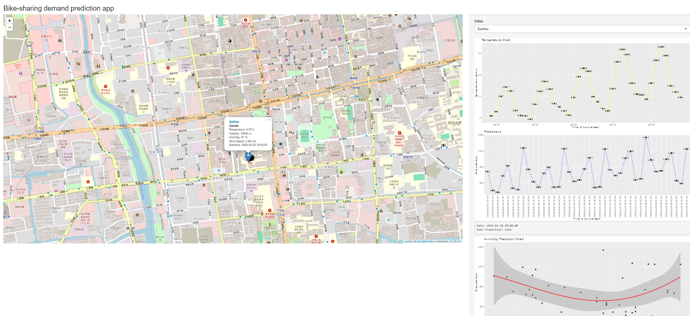
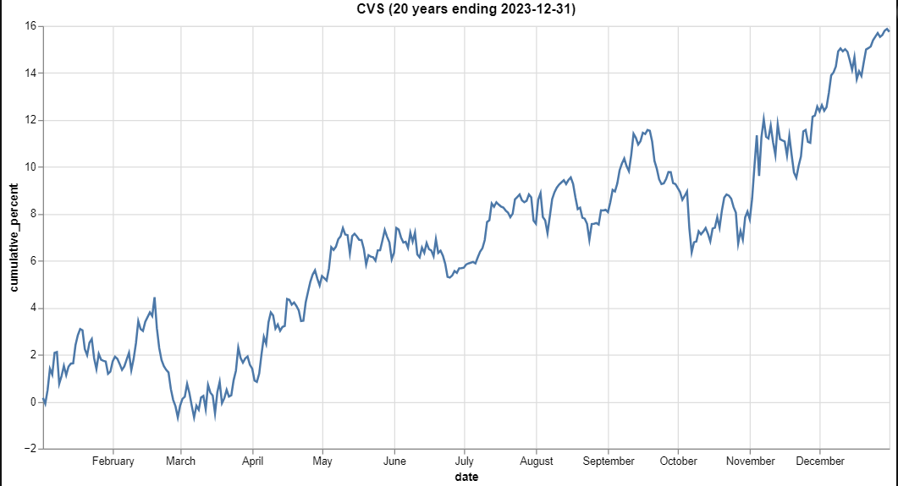
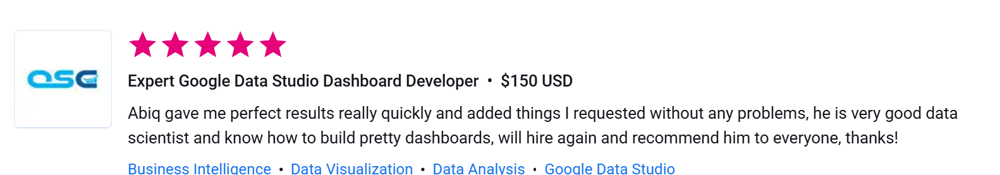
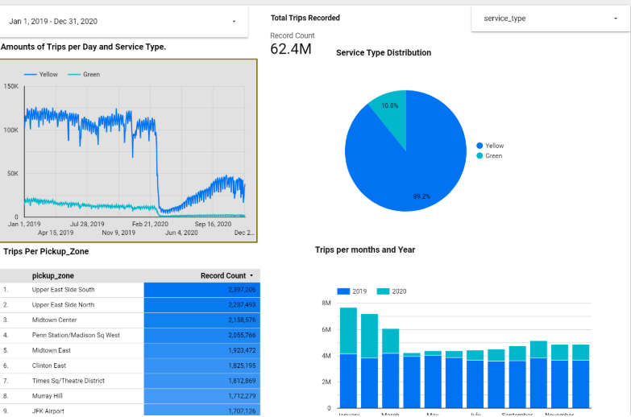
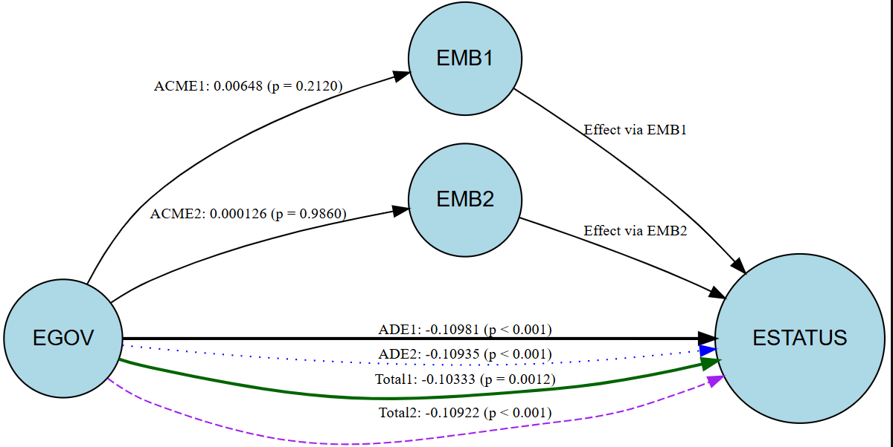

# Data Analyst / Data Scientist  
**Technical Skills: Python, SQL, R, SPSS, Google Data Studio, Excel, Prompt Engineering**
___
 **"I excel in  Machine Learning applications and statistical analysis."**
___

## 🎓 Education  
- **Bachelor in Engineering** – MUST, Pakistan 
- **Associate Degree in Engineering** – Model Science College, Pakistan  

---

## 🏆 Certifications  
- **[Machine Learning Specialization](https://lnkd.in/dAFZKgUK)** – StandfordOnline, DeepLearning.ai  
- **[IBM Data Analyst Specialization](https://www.coursera.org/account/accomplishments/specialization/certificate/GRDTX336QGAG)** – IBM, Coursera  
- **[IBM Data Analytics with Excel and R Specialization](https://www.credly.com/badges/5f8ec454-6649-46e4-b5f0-4be1e23d1348)** – IBM, Coursera
- **[Data Science Bootcamp](https://www.udemy.com/certificate/UC-40e539eb-c48b-4981-8bb3-57976f680d6e/)** – udemy
---

## 💼 Work Experience  
### **Data Analyst/Scientist** – Freelancer.com (2023 - Present)  
🔹 Build Machine Learning Models and validate those models.  
🔹 Build Dashboards and present key findings 

### **Research Analyst** – IDDDS (2021 - 2023)  
🔹 Analysed conflict data, election data and stock data.  
🔹 Articulated reports and research papers.  

---

## 🚀 Portfolio Projects  
Here are some of my key projects:  

- **Project 1: Bike Sharing Demand Prediction App**  
    
  *The data constituted of weather updates, Bike sharing demands of different cities have to be collected from various sources. The data is uncleaned containing missing values, non-numeric , undesired reference links etc. The dataset is needed to go through Exploratory Data Analysis with SQL. After pre-processing Data I have to build a Regression Model and refine that model for Predicting bike-sharing demand w.r.t several important predictors(variables). At last but not least I have to deliver my findings in form of interactive dashboard.*  
  [🔗 View Project](https://8j1z4u-aqib0ali-haidri.shinyapps.io/shinyapp/)  

- **Project 2: Stock Seasonality Equation**  
    
  *To formulate seasonality equation in python to determine the sell and buy date for assets, past 25 years data of assets has been fetched and preprocessed to build equation that would determine the best buy-sell date and seasonality in the graph. I was in contract with mobyticktrading for this project.*  
  [🔗 View Project](https://mobyticktrading.com/)  

- **Project 3: Electric Car Vehicles Adoption Trend in Europe and USA**  
    
  *The project encompassed the pulling out trend in adoptions of Electric Vehicles in Europe and USA. The Multiple Dashboards and reporting have been published on Google Data Studio/Looker Studio. Due to Client-Freelancer confidentiality, I am attaching the review only.*
  
  [🔗 View Project](https://www.freelancer.pk/u/datascientist223)  

- **Project 4: New York Taxi Rides Analysis**  
    
  *Taxi Trip Analysis Dashboard, built using Looker Studio. It visualizes NYC taxi trip data from January 1, 2019, to December 31, 2020, focusing on key metrics:

   Key Insights & Visualizations:
   📊 Total Trips Recorded: 62.4M

  📌 Service Type Distribution: Yellow (89.2%) vs. Green (10.8%)

  📅 Trips Per Day & Service Type: A time-series trend showing trip fluctuations over time.

  📍 Top Pickup Zones: A ranked list of the busiest locations for taxi pickups.

  📆 Trips per Month & Year: A bar chart comparing 2019 vs. 2020 taxi demand by month.*

  [🔗 View Project](https://lookerstudio.google.com/u/0/reporting/e1add413-304c-495a-a613-5abed8c23090/page/HDspD)  

- **Project 5: Mediation Analysis Using GLM in R**  
    
  *Total effect is negative in our case, which satisfies out hypothesis that direct effect more negatively and significantly decrease the ESTATUS, leading to total effect as negative and significant,though indirect effects through mediators are positive and insignifiacnt.*
 
  [🔗 View Project](https://www.freelancer.pk/u/datascientist223) 

---

## 📫 Connect With Me  

  

- [Data Science Blog](https://medium.com/@alihaidri51214)

⭐ **Feel free to check out my platforms and connect!** 🚀  
